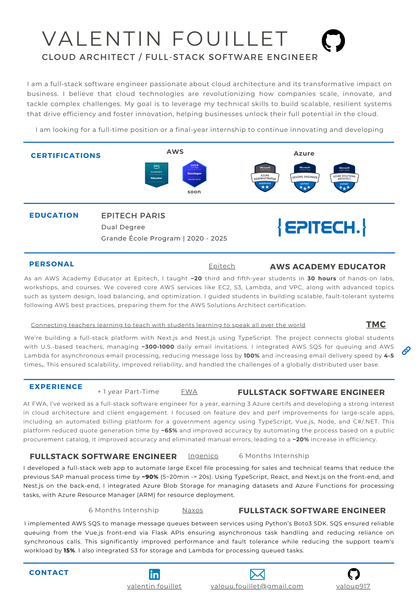

  <h1 align="center">
   
    Welcome !
 
  </h1>   

 
 

  
Welcome to my GitHub !   I'm Valentin, Solution Architect at AWS  <b>in Paris, France,</b> and old Epitech Paris
  

  
  
  

  
 
 

<h2>🈵 &nbsp; My tech</h2>
 

  
  
  
  
  
  
  
  
  
  
  
  
  
  
  
  
  
  
  
  
  
  
  
  
  
  
  

 
 

 

## Current Projects

- 💻 **[CodeReal](https://www.codereaal.com/)** - Technical hiring platform with real-world engineering missions.
- 🧠 **[Viki]()** - Intelligent assistant project focused on fast decision-making and tool-driven execution.
- 🗺️ **[Clickmap](https://www.clickmap.fr/)** - Interaction analytics project to visualize user behavior and improve UX decisions.
- 🧩 **[QuizzFlow](https://www.quizzflow.com/fr)** - Flexible quiz engine for education, onboarding, and assessments.
- 📦 **[Portio](https://www.portio.fr/)** - Goal-based savings envelopes on top of one bank account—organize money by objective without moving funds.
- 🤖 **[Jarvis]()** - AI assistant for automation, orchestration, and everyday productivity workflows.
- 💧 **[HydroSync](https://www.hydrosync.fr/)** - Smart irrigation SaaS + IoT system to optimize water usage.
- 📚 **[FlashLearn](https://chromewebstore.google.com/detail/flashlearn/mdiknbmgpflbkdkmmnkmcigipbjiedmm?pli=1)** - IT learning platform with technical quizzes and deep-dive explanations.
- 🗣️ **[LinguoFlow](https://linguoflow.com/)** - Language-learning product with interactive practice flows.

 

## Legacy Projects (School Era)

- ♻️ **[Eco Conception](https://github.com/valoup917/eco_conception)** - Eco-responsible showcase website focused on web performance and low-carbon practices.
- 🍽️ **[NFT à la carte](https://github.com/valoup917/nft-a-la-carte)** - Blockchain + gastronomy concept: turning premium dining experiences into NFTs.
- 🔔 **[Meet your soul](https://github.com/valoup917/meet-your-soul)** - PWA helping musicians connect by instrument and level.
- 👨🏼‍🏫 **[API Gateway](https://github.com/valoup917/API_gateway)** - Workshop project: JavaScript API gateway from scratch + round-robin load balancing.
- 📰 **[Le Monde 3.0](https://github.com/valoup917/Le-Monde3.0)** - Hackathon project for decentralized publishing with blockchain and IPFS.
- 🌐 **[Area](https://github.com/valoup917/Area)** - Fullstack/microservices automation platform (“if this then that” style).
- 🗳️ **[Vote.gouv](https://github.com/valoup917/Vote.gouv)** - Decentralized mobile voting concept with blockchain-backed transparency.

 
 
 

<h2>📄 &nbsp; My Resume</h2>
  

    
  

 

 

<h2>🎓 &nbsp; My Certifications</h2>
 

  
  <h2 align="center">
    AZ-104
  </h2>
 
  
  <h2 align="center">
    AZ-400
  </h2>
 
  
  <h2 align="center">
    AWS Solution Architect
  </h2>

 
 
 
 

 
 

<h2>🔍 &nbsp; Where to find me ?</h2>
 

 
 

------------

Thanks for your time !

